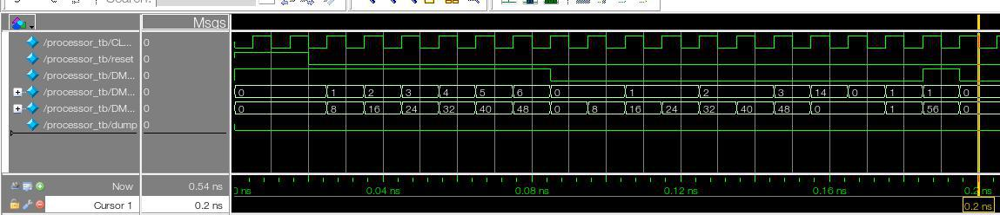
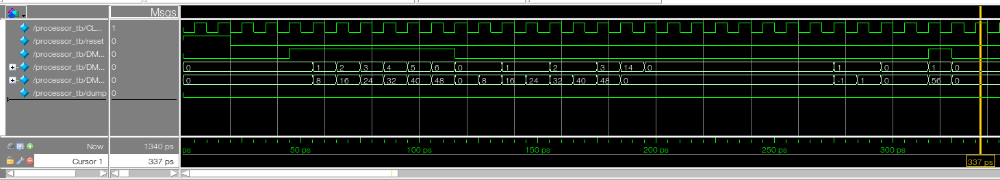

# Laboratorio ARMv8 en SystemVerilog

### Objetivos
- Desarrollar códigos en lenguaje SystemVerilog para describir circuitos secuenciales y combinacionales vistos en el teórico y el práctico.
- Utilizar la herramienta QUARTUS para analizar y sintetizar el código SystemVerilog.
- Aprender a reutilizar código SystemVerilog mediante módulos estructurales.
- Mediante el uso de test bench, analizar las formas de onda y testear los resultados obtenidos.
- Implementar una versión reducida de un microprocesador con arquitectura ARMv8 en una FPGA

## Ejercicio 1

### Regfile
Para el correcto funcionamiento del procesador con pipeline se tuvo que modificar el modulo encargado del manejo de registros.

En el procesador de un ciclo se entregaba el dato dentro del registro pedido, asumiendo que ya estaba correctamente guardado alli:

```SystemVerilog
always_comb begin
  rd1 = regs[ra1];
  rd2 = regs[ra2];
end
```

Ahora se debe contemplar si se hace WriteBack en el mismo ciclo:

```SystemVerilog
always_comb begin
  if (wa3 == ra1 && we3 && wa3 !== 31) rd1 = wd3;
  else rd1 = regs[ra1];

  if (wa3 == ra2 && we3 && wa3 !== 31) rd2 = wd3;
  else rd2 = regs[ra2];
end
```

### Testing

Para checkear el correcto funcionamiento del procesador, se hizo una corrida del procedimiento de prueba utilizado anteriormente (ej1 guia2):

```Assembly
 1. stur x0,[x0]
 2. stur x1,[x0,#8]
 3. stur x2,[x0,#16]
 4. stur x3,[x0,#24]
 5. stur x4,[x0,#32]
 6. stur x5,[x0,#40]
 7. stur x6,[x0,#48]
 8. ldur x7,[x0]
 9. ldur x8,[x0,#8]
10. ldur x9,[x0,#16]
11. ldur x10,[x0,#24]
12. ldur x11,[x0,#32]
13. ldur x12,[x0,#40]
14. ldur x13,[x0,#48]
15. sub x14,x14,x14
16. nop -------------
17. nop -------------
18. cbz x14,<loop>
19. nop -------------
20. nop -------------
21. nop -------------
22. sub x15,x0,x1
23. add x15,x0,x1
24. nop -------------
25. nop -------------
26. stur x15, [x0,#56]
```
**Nota:** Se tuvo que agregar instruccciones NOP (0x00000000) para evitar hazards de datos/control

### Comparativa

Anteriormente, en el procesador de un ciclo, necesitabamos 19 ciclos de CLK para una ejecucion correcta:



Posterior a la implementacion de pipelines el procedimiento entero se logra en 31 ciclos de CLK:


**Nota:** Si bien pareciera que el desempeño del procesador empeoró (comparando ciclos de clock), la tecnica de pipeline nos permine disminuir significativamente la frecuencia del reloj. Produciendo en la practica, mejores resultados.

## Ejercicio 2

Se carga y simula el siguiente programa:
```Assembly
1. add x0, xzr, x4
2. add x1, x0, x4
3. add x2, x1, x4
4. add x3, x2, x4
5. stur x0, [xzr, #0]
6. stur x1, [xzr, #8]
7. stur x2, [xzr, #16]
8. stur x3, [xzr, #24]
```

Luego de simularlo y no obtener los resultados esperados, vemos rapidamente que hay multiples dependencias de dato que estan produciendo hazards (ej: HD X0 1(EX) 2(ID))

Se procede a modificar el codigo buscando su correcto funcionamiento:

```Assembly
 1. add x0, xzr, x4
 2. nop -------------
 3. nop -------------
 4. add x1, x0, x4
 5. stur x0, [xzr, #0]
 6. nop -------------
 7. add x2, x1, x4
 8. stur x1, [xzr, #8]
 9. nop -------------
10. add x3, x2, x4
11. stur x2, [xzr, #16]
12. nop -------------
13. stur x3, [xzr, #24]
```
Y luego comprobamos que el contenido de la memoria es el calculado (con una corrida 'a mano'):

```
Memoria RAM de Arm:
Address Data
0 0000000000000004
1 0000000000000008
2 000000000000000C
3 0000000000000010
4 0000000000000000
        ...
63 0000000000000000
```

## Ejercicio 3
Se agregaron a nuestro procesador con pipeline dos instrucciones nuevas (ADDI y CBNZ).
Se presenta a continuacion breve descripcion de los cambios introducidos para lograrlo.

No se agregan entidades o señales que modifiquen el diagrama general del microprocesador.

### ADDI
- **Signext:** Se modifica el modulo para que contemple el nuevo opcode y la nueva estructura I-Type

- **Maindec:** Se agrega al modulo la interpretacion del nuevo opcode. Muy similar al de ADD pero con otro AluSrc (para que tome el inmediato desde el signext)

- **Aludec:** Se relaciona el opcode del ADDI con la operacion de adicion de la ALU

Procedimiento utilizado para testear la operacion:
```Assembly
1. addi	x1, xzr, #15
2. nop -------------
3. nop -------------
4. stur	x1, [x0, #0]
```

### CBNZ
- **Signext:** Se modifica el modulo de extension de signo, para que tambien contemple el opcode de la instruccion CBNZ para la extension de la direccion de branch.

- **Maindec:** Se agrega al modulo la linea que interpreta el nuevo opcode. Muy similar al de CBZ, pero con nuevo AluOP (0b11).

- **Aludec:** Se relaciona este nuevo AluOP con una nueva señal de control para la alu (0b1111)

- **Alu:** Valiendonos de que esta señal de control es la unica que no posee ceros, se utilizó el operador logico AND para crear una señal de 1bit con semantica 'la operacion es CBNZ'.

  Luego, esta señal nos sirve para "negar" la señal Zero_E de forma que se produzca el branch cuando sea pertinente.

Procedimiento utilizado para testear la operacion:
```Assembly
 1. add x0, xzr, x6
 2. add x2, xzr, xzr
 3. nop -------------
 4. loop: sub x0, x0, x1
 5. add x2, x2, x1
 6. nop -------------
 7. cbnz x0, <loop>
 8. nop -------------
 9. nop -------------
10. nop -------------
11. stur x0, [xzr, #0]
12. stur x2, [xzr, #8]
```
